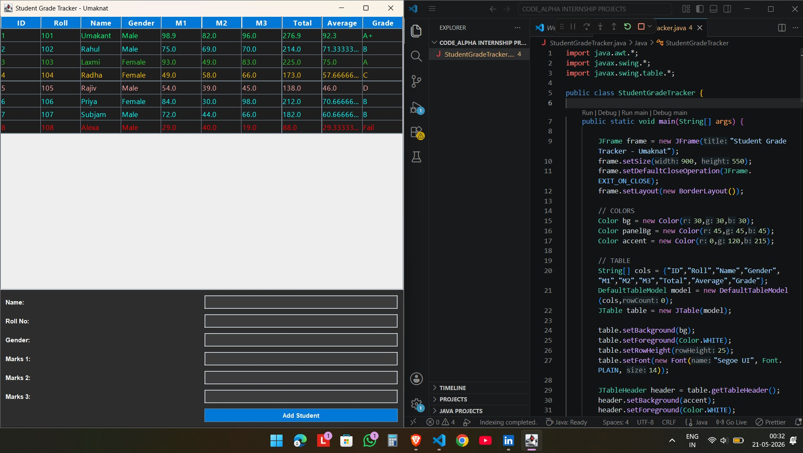

# 🎓 Student Grade Tracker (Java)

This is a simple Java-based Student Grade Tracker application built using Swing GUI.  
It allows users to manage student records, calculate total marks, average, and assign grades automatically.

---

##  Features

- Add student details (Name, Roll No, Gender, Marks)
- Automatic calculation of Total and Average
- Grade assignment based on percentage
- Input validation (handles invalid input)
- Clean and simple GUI design
- Displays all students in a table format

---

## 📸 Screenshot

---

## Technologies Used

- Java
- Swing (GUI)
- AWT

---

##  Grading System

- 90 and above → A+
- 80 – 89 → A
- 70 – 79 → B+
- 60 – 69 → B
- 50 – 59 → C+
- 40 – 49 → C
- Below 40 → Fail

---

##  Purpose

This project is developed as part of my learning during the **CodeAlpha Internship**.  
It helped me understand Java GUI, logic building, and basic project structure.

---

##  Author

**Umakant Sah**  
📧 Email: (umakantcoder5333@gmail.com)

---
